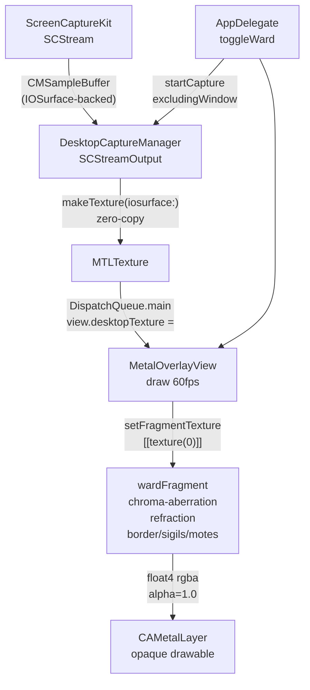

# Phase 1c: ScreenCaptureKit → Metal Texture

## How the handoff works (2 sentences)

SCStream delivers each captured frame to `SCStreamOutput.stream(_:didOutputSampleBuffer:)` on a background thread as a `CMSampleBuffer` wrapping an IOSurface-backed `CVPixelBuffer`. We extract the `IOSurface` and call `device.makeTexture(descriptor:iosurface:plane:)` — Metal maps directly onto the IOSurface's GPU memory with zero pixel copying — then dispatch the texture update to the main thread so `wardFragment` can sample it each draw tick.

---

## Step 0 — Xcode UI (you do this before I touch any file)

No code edits — two clicks in Xcode.

**A. Add the Screen Capture privacy description (needed because `GENERATE_INFOPLIST_FILE = YES`):**
- Select the `Wardlume` target → **Info** tab → **Custom macOS Application Target Properties**
- Click **+**, type `Privacy - Screen Capture Usage Description` (key = `NSScreenCaptureDescription`)
- Set the string value: `Wardlume needs Screen Recording access to render live desktop refraction.`

**B. Confirm the entitlements file exists:**
- Select `Wardlume` target → **Signing & Capabilities** tab
- Verify that the **App Sandbox** capability is already listed (it is — `ENABLE_APP_SANDBOX = YES`)
- Click the **+** at top-left of Signing & Capabilities, search **Screen Recording**, and add it
- This writes `com.apple.security.screen-recording = YES` into the auto-generated `.entitlements` file Xcode manages alongside the sandbox entitlement

After doing both, build once (⌘B) to confirm no regressions, then give me "✅ builds" and I will send File 1.

---

## Files — one at a time, in order

### File 1 — `MetalOverlayView.swift` (modify)

Three changes to prepare the view for an opaque, texture-fed pipeline:

- **Opaque surface** — flip `isOpaque` override to `true`, set `layer?.isOpaque = true`, change `clearColor` to `MTLClearColorMake(0,0,0,1)`. The window frame in `AppDelegate` will also be made opaque when the ward activates.
- **Fallback 1×1 black texture** — created in `buildPipeline()` so `desktopTexture` is never `nil` when the shader is first sampled (before SCStream delivers a frame). This prevents a Metal null-texture crash.
- **Texture binding in `draw()`** — add `encoder.setFragmentTexture(desktopTexture, index: 0)` just before `drawPrimitives`. The property itself is a plain `var desktopTexture: MTLTexture?`; thread safety is handled by always updating it on `DispatchQueue.main` from the capture callback, matching the display-link thread that calls `draw()`.
- **Keep blending disabled** — since the window is now opaque and alpha = 1.0 from the shader, the blend equation is a no-op; leaving it enabled is harmless.

### File 2 — `WardShader.metal` (modify)

Add the desktop texture as a new parameter and rewire the color composition:

```
fragment float4 wardFragment(VertexOut in [[stage_in]],
                             constant ShaderParams &p [[buffer(0)]],
                             texture2d<float> desktopTex [[texture(0)]])
```

- Declare `constexpr sampler s(address::clamp_to_edge, filter::linear);`
- **Chromatic aberration** — sample three times with the channels already computed:
  - Red channel: `desktopTex.sample(s, uvR).r`
  - Green channel: `desktopTex.sample(s, uvDisp).g`
  - Blue channel: `desktopTex.sample(s, uvB).b`
  - Compose: `float3 desktop = float3(deskR, deskG, deskB);`
- All existing effects (sheen, shimmer, border, sigils, motes) accumulate **on top** of `desktop` exactly as before — no math changes needed.
- Final line changes to `return float4(colour, 1.0);` — alpha is always 1, window is opaque.
- `baseAlpha` field is no longer added to the alpha accumulator (it drove the glass transparency that is now replaced by the real desktop pixels). The field stays in the struct to avoid a Swift-side change, it just isn't used.

### File 3 — `DesktopCaptureManager.swift` (new file)

The entire SCStream machinery lives here, isolated from the view:

```
import ScreenCaptureKit
import CoreVideo
import MetalKit

@MainActor          // all public methods called from main thread
final class DesktopCaptureManager: NSObject, SCStreamOutput {

    private let device:    MTLDevice
    private weak var view: MetalOverlayView?
    private var stream:    SCStream?

    init(device: MTLDevice, view: MetalOverlayView) { … }

    func startCapture(excludingWindow overlayWindow: NSWindow) async throws { … }
    func stopCapture() { … }

    // SCStreamOutput — called on background thread
    func stream(_ stream: SCStream,
                didOutputSampleBuffer buffer: CMSampleBuffer,
                of type: SCStreamOutputType) { … }
}
```

Key implementation notes:
- `startCapture` calls `SCShareableContent.excludingDesktopWindows(false, onScreenWindowsOnly: true)` (async), then finds the `SCWindow` whose `windowID == UInt32(overlayWindow.windowNumber)` and builds `SCContentFilter(display: mainDisplay, excludingWindows: [wardWindow])`.
- `SCStreamConfiguration`: `pixelFormat = kCVPixelFormatType_32BGRA`, width/height from `screen.frame × backingScaleFactor`, `minimumFrameInterval = CMTime(value:1, timescale:60)`, `showsCursor = false`.
- In the `SCStreamOutput` callback: extract `CVImageBuffer` → IOSurface via `CVPixelBufferGetIOSurface` → create `MTLTexture` with `device.makeTexture(descriptor:iosurface:plane:0)` (`storageMode = .shared` — required for IOSurface-backed textures) → dispatch to main: `DispatchQueue.main.async { self.view?.desktopTexture = texture }`.

### File 4 — `AppDelegate.swift` (modify)

Three additions:

- **Permission request at launch** — in `applicationDidFinishLaunching`, call `CGRequestScreenCaptureAccess()`. If `CGPreflightScreenCaptureAccess()` returns `false`, show an `NSAlert` directing the user to System Settings → Privacy & Security → Screen Recording and then quit.
- **Start capture on activate** — in the "activate" branch of `toggleWard()`, after `metalView` is created:
  ```swift
  let mgr = DesktopCaptureManager(device: metalView.device!, view: metalView)
  captureManager = mgr
  Task { try? await mgr.startCapture(excludingWindow: window) }
  ```
  Also set `window.isOpaque = true` and `window.backgroundColor = .black` (the shader covers every pixel now).
- **Stop capture on deactivate** — call `captureManager?.stopCapture(); captureManager = nil` before `window.close()`.

---

## Architecture diagram



---

## What does NOT change

- `ShaderParams` struct — no new fields; `baseAlpha` stays (just unused in final alpha now)
- All border, sigil, mote, and iridescent-sheen math — unchanged
- Menu bar item, window level, `ignoresMouseEvents` — unchanged
- `rippleStrength`, `rippleSpeed`, `aspectRatio` — unchanged; the displacement field that was driving a fake refraction illusion now drives real pixel displacement on the desktop texture, making the effect physically grounded

---

Say **"go"** and I will send File 1 (`MetalOverlayView.swift`). After you confirm "✅ builds", I will send File 2, and so on.
