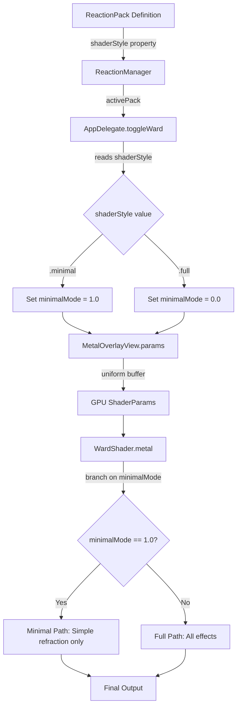
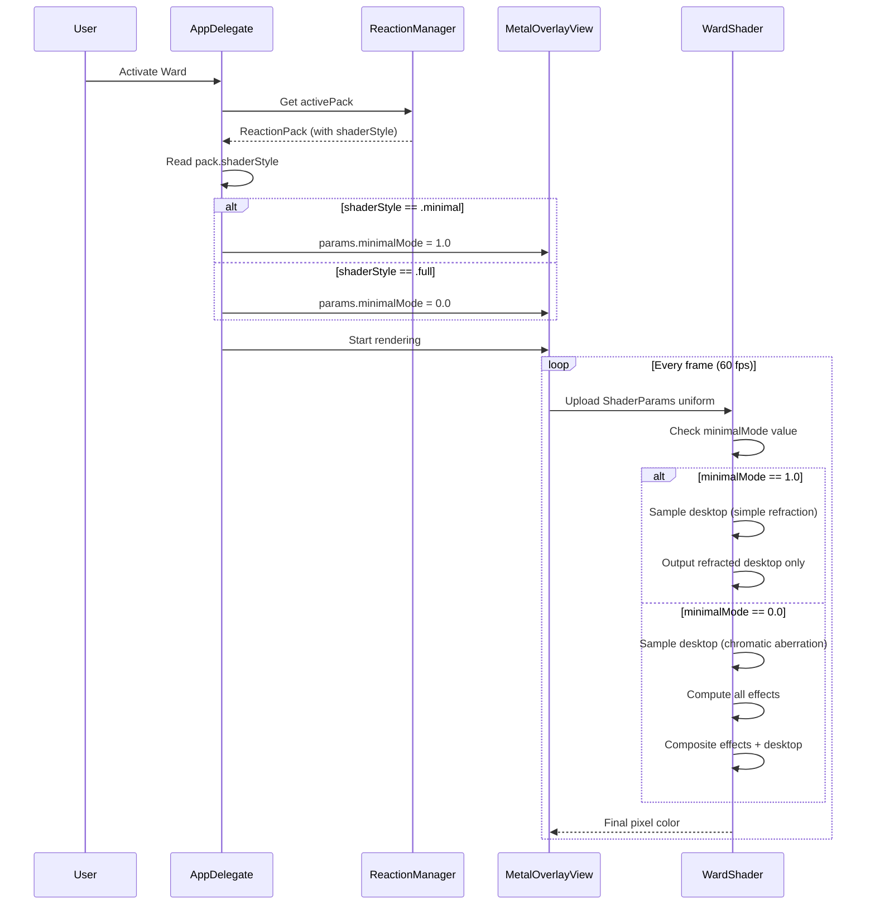
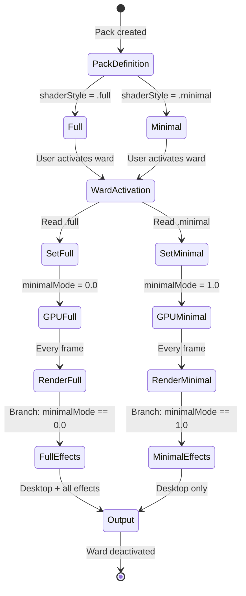

# Design Document: Minimal Shader Mode

## Overview

This design adds a minimal shader rendering mode to Wardlume that displays only glass refraction over the live desktop, removing all decorative visual effects. The feature enables reaction packs to choose between two rendering modes:

- **Minimal mode**: Simple refraction without chromatic aberration, no rainbow border, sigils, motes, sheen, or shimmer (for silentProfessional pack)
- **Full mode**: All seven visual effects active (for grumpyOldMan and wizard packs)

The implementation adds a `ShaderStyle` enum to `ReactionPack`, a `minimalMode` uniform to `ShaderParams`, conditional branching in the Metal shader, and mode activation logic in `AppDelegate`. The design preserves byte alignment between Swift and Metal structs, maintains backward compatibility with Phase 4 features (base images, user overrides, accessibility), and requires no changes to the existing effect computation code.

## Architecture

### High-Level Data Flow



### Component Interaction



## Components and Interfaces

### 1. ReactionPack.swift

#### ShaderStyle Enum

```swift
/// Determines the Metal shader rendering mode for the ward overlay.
///
/// - `.full`:    All seven visual effects active (rainbow border, sigils,
///               motes, sheen, shimmer, chromatic aberration, ripple displacement)
/// - `.minimal`: Only glass refraction over live desktop (no decorative effects,
///               no chromatic aberration)
enum ShaderStyle {
    case full
    case minimal
}
```

**Design Rationale:**
- Enum provides type-safe shader mode selection
- Two cases map directly to the two rendering paths in the shader
- Named `.full` and `.minimal` (not `.normal`/`.reduced`) to clearly communicate intent
- Placed before `PackStyle` enum in the file for logical grouping of pack configuration types

#### ReactionPack Struct Extension

```swift
struct ReactionPack {
    // ... existing properties ...
    
    /// Metal shader rendering mode. Determines whether the ward overlay
    /// displays all visual effects (.full) or only glass refraction (.minimal).
    let shaderStyle: ShaderStyle
}
```

**Integration Points:**
- Added as the last property in the struct (after `style: PackStyle`)
- Immutable (`let`) like all other pack properties
- Read by `AppDelegate` during ward activation to set `minimalMode` uniform

#### Pack Definitions Update

```swift
static let grumpyOldMan = ReactionPack(
    // ... existing parameters ...
    style: .image,
    shaderStyle: .full  // NEW
)

static let wizard = ReactionPack(
    // ... existing parameters ...
    style: .image,
    shaderStyle: .full  // NEW
)

static let silentProfessional = ReactionPack(
    // ... existing parameters ...
    style: .minimal,
    shaderStyle: .minimal  // NEW
)
```

**Design Decisions:**
- `grumpyOldMan` and `wizard` use `.full` to preserve existing visual richness
- `silentProfessional` uses `.minimal` for calm, distraction-free productivity shield
- `shaderStyle` is independent of `style` (PackStyle) — a pack can be `.image` style with either shader mode

### 2. MetalOverlayView.swift

#### ShaderParams Struct Extension

```swift
struct ShaderParams {
    var time:             Float = 0.0
    var rippleStrength:   Float = 0.018
    var rippleSpeed:      Float = 0.35
    var shimmerIntensity: Float = 0.18
    var baseAlpha:        Float = 0.05
    var tintR:            Float = 0.35
    var tintG:            Float = 0.60
    var tintB:            Float = 1.00
    var aspectRatio:      Float = 1.77
    var lastIntrusionT:   Float = -9999.0
    var minimalMode:      Float = 0.0    // NEW: 1.0 = minimal, 0.0 = full
    var reduceMotion:     Float = 0.0
}
```

**Memory Layout Analysis:**

```
Offset  Size  Field
------  ----  -----
0       4     time
4       4     rippleStrength
8       4     rippleSpeed
12      4     shimmerIntensity
16      4     baseAlpha
20      4     tintR
24      4     tintG
28      4     tintB
32      4     aspectRatio
36      4     lastIntrusionT
40      4     minimalMode      ← NEW (position 11)
44      4     reduceMotion
------  ----
Total: 48 bytes
```

**Design Rationale:**
- `minimalMode` inserted at position 11 (after `lastIntrusionT`, before `reduceMotion`)
- Type `Float` matches all other shader parameters (Metal uses `float`, Swift uses `Float`)
- Default value `0.0` means full mode (backward compatible if not explicitly set)
- No padding needed — all fields are 4-byte aligned `Float` values
- Total struct size remains a multiple of 4 bytes (48 bytes)

**Integration Points:**
- Set by `AppDelegate.toggleWard()` before starting desktop capture
- Uploaded to GPU every frame via `withUnsafeBytes` in `draw(in:)`
- Read by Metal shader as `p.minimalMode` in fragment function

### 3. WardShader.metal

#### ShaderParams Struct Extension

```metal
struct ShaderParams {
    float time;
    float rippleStrength;
    float rippleSpeed;
    float shimmerIntensity;
    float baseAlpha;
    float tintR;
    float tintG;
    float tintB;
    float aspectRatio;
    float lastIntrusionT;
    float minimalMode;      // NEW: 1.0 = minimal, 0.0 = full
};
```

**Byte Alignment Verification:**

The Metal struct must match the Swift struct byte-for-byte. Metal's alignment rules for `float`:
- Size: 4 bytes
- Alignment: 4 bytes
- No padding between consecutive `float` fields

```
Metal Offset  Swift Offset  Field
------------  ------------  -----
0             0             time
4             4             rippleStrength
8             8             rippleSpeed
12            12            shimmerIntensity
16            16            baseAlpha
20            20            tintR
24            24            tintG
28            28            tintB
32            32            aspectRatio
36            36            lastIntrusionT
40            40            minimalMode      ← MATCH
44            44            reduceMotion (Swift only, not in Metal yet)
```

**Critical Constraint:**
- `minimalMode` MUST be at byte offset 40 in both structs
- Adding `minimalMode` to Metal struct does NOT require adding `reduceMotion` (Metal struct can be shorter)
- However, for future maintainability, we should keep them in sync

**Recommendation:** Add `reduceMotion` to Metal struct as well (even if unused) to maintain perfect struct parity:

```metal
struct ShaderParams {
    float time;
    float rippleStrength;
    float rippleSpeed;
    float shimmerIntensity;
    float baseAlpha;
    float tintR;
    float tintG;
    float tintB;
    float aspectRatio;
    float lastIntrusionT;
    float minimalMode;      // NEW
    float reduceMotion;     // Added for struct parity (currently unused in shader)
};
```

#### Desktop Sampling Logic

**Current Implementation (Full Mode):**

```metal
// Section 3b: DESKTOP TEXTURE (lines ~180-195)
float  chromaAmt = p.rippleStrength * ripplePeak * 0.9;
float2 uvR = uvDisp + float2( chromaAmt * 0.9, -chromaAmt * 0.4);
float2 uvB = uvDisp + float2(-chromaAmt * 0.7,  chromaAmt * 0.5);

float3 desktop = float3(
    desktopTex.sample(tex_s, uvR).r,      // Red channel: shifted UV
    desktopTex.sample(tex_s, uvDisp).g,   // Green channel: base displaced UV
    desktopTex.sample(tex_s, uvB).b       // Blue channel: shifted UV
);
```

**New Implementation (Conditional Branching):**

```metal
// Section 3b: DESKTOP TEXTURE — conditional chromatic aberration
float3 desktop;
if (p.minimalMode > 0.5) {
    // Minimal mode: simple refraction (no chromatic aberration)
    // Sample all three RGB channels from the same displaced UV
    desktop = desktopTex.sample(tex_s, uvDisp).rgb;
} else {
    // Full mode: chromatic aberration (existing behavior)
    float  chromaAmt = p.rippleStrength * ripplePeak * 0.9;
    float2 uvR = uvDisp + float2( chromaAmt * 0.9, -chromaAmt * 0.4);
    float2 uvB = uvDisp + float2(-chromaAmt * 0.7,  chromaAmt * 0.5);
    
    desktop = float3(
        desktopTex.sample(tex_s, uvR).r,
        desktopTex.sample(tex_s, uvDisp).g,
        desktopTex.sample(tex_s, uvB).b
    );
}
```

**Design Rationale:**
- Branch condition `p.minimalMode > 0.5` (not `== 1.0`) for floating-point safety
- Minimal path samples `.rgb` once (3 texture reads → 1 texture read)
- Full path preserves existing chromatic aberration logic unchanged
- `uvDisp` (refraction displacement) applies in both modes
- Ripple displacement field (section 1) still computed in both modes (needed for `uvDisp`)

#### Final Composition Logic

**Current Implementation (Full Mode):**

```metal
// Section 8: FINAL COLOR (lines ~380-395)
float3 colour = desktop + sheen + shimmer + sigilColor + moteColor;

float pulseAge  = p.time - p.lastIntrusionT;
float pulseMult = 1.0 + 0.30 * saturate(1.0 - pulseAge / 0.20);
colour += borderColor * (borderFade * pulseMult + bloomBoost);
colour  = clamp(colour, float3(0.0), float3(1.0));

return float4(colour, 1.0);
```

**New Implementation (Conditional Composition):**

```metal
// Section 8: FINAL COLOR — conditional effect composition
float3 colour;
if (p.minimalMode > 0.5) {
    // Minimal mode: output only refracted desktop (no decorative effects)
    colour = desktop;
} else {
    // Full mode: desktop + all effects (existing behavior)
    colour = desktop + sheen + shimmer + sigilColor + moteColor;
    
    float pulseAge  = p.time - p.lastIntrusionT;
    float pulseMult = 1.0 + 0.30 * saturate(1.0 - pulseAge / 0.20);
    colour += borderColor * (borderFade * pulseMult + bloomBoost);
}

colour = clamp(colour, float3(0.0), float3(1.0));
return float4(colour, 1.0);
```

**Design Rationale:**
- Minimal mode outputs `desktop` directly (no additive effects)
- Full mode preserves existing composition logic unchanged
- `clamp()` and `return` statements outside the branch (apply to both modes)
- Effect computation sections (1-7) remain unchanged — computed but unused in minimal mode
- This design minimizes code changes and preserves existing behavior for full mode

**Performance Consideration:**
- Minimal mode still computes all effects (sheen, shimmer, sigils, motes, border) but doesn't composite them
- This is acceptable because:
  1. Effect computation is cheap compared to texture sampling
  2. Branching on composition is simpler than branching throughout all effect sections
  3. Code remains maintainable (no effect-specific conditional logic scattered everywhere)
- Future optimization: Add early-out branches in effect sections if profiling shows significant cost

### 4. AppDelegate.swift

#### Mode Activation Logic

**Current Ward Activation Code (lines ~200-250):**

```swift
// --- Activate: create window, start capture, install input lock --
let screenFrame = NSScreen.main?.frame ?? .zero
let window = NSWindow(...)
let metalView = MetalOverlayView(frame: screenFrame)
window.contentView = metalView

// Phase 4b: layer base image above Metal shader if one is resolved
let activePack = reactionManager?.activePack ?? .silentProfessional
if let baseURL = ReactionPack.resolvedBaseImageURL(for: activePack),
   let image = NSImage(contentsOf: baseURL) {
    // ... base image rendering ...
    metalView.isPaused = true
} else {
    baseImageView = nil
    metalView.isPaused = false
}

// Start desktop capture
guard let device = metalView.device else { return }
let capture = DesktopCaptureManager(device: device, view: metalView)
captureManager = capture
capture.startCapture(excludingWindow: window)
```

**New Implementation (Add Mode Setting):**

```swift
// Phase 4b: layer base image above Metal shader if one is resolved
let activePack = reactionManager?.activePack ?? .silentProfessional

// Phase 5a: set shader mode based on pack's shaderStyle
metalView.params.minimalMode = (activePack.shaderStyle == .minimal) ? 1.0 : 0.0

if let baseURL = ReactionPack.resolvedBaseImageURL(for: activePack),
   let image = NSImage(contentsOf: baseURL) {
    // ... base image rendering ...
    metalView.isPaused = true
} else {
    baseImageView = nil
    metalView.isPaused = false
}

// Start desktop capture
guard let device = metalView.device else { return }
let capture = DesktopCaptureManager(device: device, view: metalView)
captureManager = capture
capture.startCapture(excludingWindow: window)
```

**Design Rationale:**
- Mode set BEFORE base image check (mode applies regardless of base image presence)
- Mode set BEFORE desktop capture starts (uniform ready before first frame)
- Ternary expression `(activePack.shaderStyle == .minimal) ? 1.0 : 0.0` is clear and concise
- Fallback pack (`.silentProfessional`) has `.minimal` shader style, so default is minimal mode
- No changes needed in deactivation path (mode reset happens naturally on next activation)

**Integration with Base Images:**
- Base image rendering is independent of shader mode
- When base image is present: Metal paused, base image displayed (existing Phase 4b behavior)
- When base image is absent: Metal renders with mode determined by `minimalMode` uniform
- This means:
  - `grumpyOldMan` with base image → base image shown, Metal paused (shader mode irrelevant)
  - `grumpyOldMan` without base image → Metal renders in full mode
  - `silentProfessional` (no base image by design) → Metal renders in minimal mode

## Data Models

### ShaderParams Memory Layout Diagram

```
┌─────────────────────────────────────────────────────────────┐
│                    ShaderParams Struct                       │
│                      (48 bytes total)                        │
├────────┬────────┬──────────────────────────────────────────┤
│ Offset │  Size  │  Field Name                               │
├────────┼────────┼──────────────────────────────────────────┤
│   0    │   4    │  time                                     │
│   4    │   4    │  rippleStrength                           │
│   8    │   4    │  rippleSpeed                              │
│  12    │   4    │  shimmerIntensity                         │
│  16    │   4    │  baseAlpha                                │
│  20    │   4    │  tintR                                    │
│  24    │   4    │  tintG                                    │
│  28    │   4    │  tintB                                    │
│  32    │   4    │  aspectRatio                              │
│  36    │   4    │  lastIntrusionT                           │
│  40    │   4    │  minimalMode          ← NEW (Phase 5a)   │
│  44    │   4    │  reduceMotion         (Swift only)       │
└────────┴────────┴──────────────────────────────────────────┘

Swift struct size:  48 bytes (12 fields × 4 bytes)
Metal struct size:  44 bytes (11 fields × 4 bytes) — current
Metal struct size:  48 bytes (12 fields × 4 bytes) — recommended

Alignment: All fields are Float (4-byte aligned)
Padding:   None required (all fields are same size)
```

### ShaderStyle State Machine



## Error Handling

### Struct Alignment Mismatch

**Risk:** If Swift and Metal `ShaderParams` structs have different byte layouts, uniform buffer uploads will corrupt GPU memory, causing visual glitches or crashes.

**Prevention:**
1. Add `minimalMode` at the same position (11) in both structs
2. Verify byte offsets match using the memory layout table above
3. Add compile-time assertion in Swift (optional but recommended):

```swift
// In MetalOverlayView.swift, after ShaderParams definition
#if DEBUG
private func verifyShaderParamsLayout() {
    assert(MemoryLayout<ShaderParams>.size == 48, 
           "ShaderParams size mismatch: expected 48 bytes")
    assert(MemoryLayout<ShaderParams>.alignment == 4,
           "ShaderParams alignment mismatch: expected 4-byte alignment")
}
#endif
```

**Detection:**
- Build-time: Xcode will show warnings if struct sizes don't match expected values
- Runtime: Visual artifacts (wrong colors, flickering) indicate uniform corruption
- Debug: Use Metal Frame Capture to inspect uniform buffer contents

**Recovery:**
- If mismatch detected: Review struct definitions, verify field order and types
- Use `print(MemoryLayout<ShaderParams>.size)` to debug actual struct size
- Ensure no implicit padding (all fields are `Float`, no mixed types)

### Invalid minimalMode Values

**Risk:** If `minimalMode` is set to a value other than 0.0 or 1.0, shader behavior is undefined.

**Prevention:**
- Use ternary expression in `AppDelegate` to guarantee 0.0 or 1.0
- Branch condition `p.minimalMode > 0.5` tolerates floating-point imprecision

**Detection:**
- Values between 0.0 and 1.0 (exclusive) will trigger full mode (> 0.5 check)
- Negative values or NaN will trigger full mode (> 0.5 check fails)

**Recovery:**
- No recovery needed — shader defaults to full mode for invalid values
- Add debug logging in `AppDelegate` to verify mode setting:

```swift
metalView.params.minimalMode = (activePack.shaderStyle == .minimal) ? 1.0 : 0.0
print("Wardlume [AppDelegate]: shader mode set to \(metalView.params.minimalMode) " +
      "for pack \(activePack.id)")
```

### Missing shaderStyle Property

**Risk:** If a pack definition is missing `shaderStyle`, compilation will fail.

**Prevention:**
- `shaderStyle` is a non-optional `let` property in `ReactionPack` struct
- Swift compiler enforces that all initializers provide a value
- All three built-in packs updated with explicit `shaderStyle` values

**Detection:**
- Compile-time error: "Missing argument for parameter 'shaderStyle' in call"

**Recovery:**
- Add `shaderStyle: .full` or `shaderStyle: .minimal` to pack definition
- Default to `.full` for image packs, `.minimal` for minimal packs

## Correctness Properties

**Property-based testing does not apply to this feature.**

This feature involves:
1. **GPU shader configuration** - Infrastructure-like setup (enum, struct fields, uniform buffer)
2. **Visual rendering output** - GPU-side pixel shader branching and composition
3. **Configuration validation** - Simple enum-based mode selection

According to PBT applicability guidelines, property-based testing is NOT appropriate for:
- Infrastructure as Code (IaC) and infrastructure-like configuration
- UI rendering and visual output
- Configuration validation with simple enums

**Testing approach for this feature:**
- **Unit tests** for struct byte alignment and size verification
- **Integration tests** for mode activation logic
- **Visual verification tests** for rendering correctness
- **Snapshot tests** for shader output (if Metal frame capture supports it)

These testing strategies provide comprehensive coverage without property-based testing.

## Testing Strategy

### Unit Tests

**Test 1: ShaderParams Struct Size**
```swift
func testShaderParamsSize() {
    XCTAssertEqual(MemoryLayout<ShaderParams>.size, 48,
                   "ShaderParams must be 48 bytes (12 fields × 4 bytes)")
}
```

**Test 2: ShaderParams Field Offsets**
```swift
func testShaderParamsFieldOffsets() {
    var params = ShaderParams()
    withUnsafePointer(to: &params.minimalMode) { minimalPtr in
        withUnsafePointer(to: &params) { basePtr in
            let offset = UnsafeRawPointer(minimalPtr).distance(to: UnsafeRawPointer(basePtr))
            XCTAssertEqual(offset, 40, "minimalMode must be at byte offset 40")
        }
    }
}
```

**Test 3: Pack ShaderStyle Values**
```swift
func testPackShaderStyles() {
    XCTAssertEqual(ReactionPack.silentProfessional.shaderStyle, .minimal)
    XCTAssertEqual(ReactionPack.grumpyOldMan.shaderStyle, .full)
    XCTAssertEqual(ReactionPack.wizard.shaderStyle, .full)
}
```

**Test 4: Mode Setting Logic**
```swift
func testMinimalModeSettingLogic() {
    let minimalPack = ReactionPack.silentProfessional
    let fullPack = ReactionPack.grumpyOldMan
    
    let minimalValue: Float = (minimalPack.shaderStyle == .minimal) ? 1.0 : 0.0
    let fullValue: Float = (fullPack.shaderStyle == .minimal) ? 1.0 : 0.0
    
    XCTAssertEqual(minimalValue, 1.0)
    XCTAssertEqual(fullValue, 0.0)
}
```

### Integration Tests

**Test 5: Ward Activation with Minimal Mode**
1. Set active pack to `silentProfessional`
2. Activate ward
3. Verify `MetalOverlayView.params.minimalMode == 1.0`
4. Verify Metal shader renders (no crash)
5. Deactivate ward

**Test 6: Ward Activation with Full Mode**
1. Set active pack to `grumpyOldMan`
2. Activate ward
3. Verify `MetalOverlayView.params.minimalMode == 0.0`
4. Verify Metal shader renders (no crash)
5. Deactivate ward

**Test 7: Mode Switching Between Activations**
1. Set active pack to `silentProfessional`, activate ward, verify minimal mode, deactivate
2. Set active pack to `wizard`, activate ward, verify full mode, deactivate
3. Set active pack to `silentProfessional`, activate ward, verify minimal mode, deactivate

### Visual Verification Tests

**Test 8: Minimal Mode Visual Output**
1. Set active pack to `silentProfessional`
2. Activate ward
3. **Expected:** Refracted glass over desktop, no rainbow border, no sigils, no motes
4. **Verify:** Desktop content is clearly visible through refraction
5. **Verify:** No chromatic color fringing at edges (simple refraction, not chromatic aberration)

**Test 9: Full Mode Visual Output**
1. Set active pack to `grumpyOldMan` (remove base image asset to force Metal rendering)
2. Activate ward
3. **Expected:** Refracted desktop + rainbow border + sigils + motes + chromatic aberration
4. **Verify:** All seven effects visible (border, sigils, motes, sheen, shimmer, ripples, chromatic aberration)

**Test 10: Base Image Independence**
1. Set active pack to `grumpyOldMan` (with base image asset present)
2. Activate ward
3. **Expected:** Base image displayed, Metal paused (shader mode irrelevant)
4. **Verify:** Base image occludes Metal shader completely

### Performance Tests

**Test 11: Frame Rate Comparison**
1. Measure average FPS with `silentProfessional` (minimal mode) over 60 seconds
2. Measure average FPS with `grumpyOldMan` (full mode, no base image) over 60 seconds
3. **Expected:** Minimal mode FPS ≥ full mode FPS (fewer texture samples, no effect composition)
4. **Acceptable:** FPS difference < 5% (effect computation is cheap)

**Test 12: GPU Memory Usage**
1. Activate ward with minimal mode, capture Metal frame, inspect uniform buffer
2. Verify `minimalMode` field contains 1.0 at byte offset 40
3. Activate ward with full mode, capture Metal frame, inspect uniform buffer
4. Verify `minimalMode` field contains 0.0 at byte offset 40

### Regression Tests

**Test 13: Phase 4b Base Image Rendering**
1. Verify base image rendering still works for packs with base images
2. Verify user override base images still work (UserAssetManager)
3. Verify Metal pauses when base image is present

**Test 14: Phase 4c Reduce Motion**
1. Enable Reduce Motion in System Settings
2. Activate ward with minimal mode
3. Verify ripple strength and shimmer intensity are reduced
4. Activate ward with full mode
5. Verify ripple strength and shimmer intensity are reduced

**Test 15: Phase 2a Intrusion Pulse**
1. Activate ward with full mode
2. Trigger intrusion event (type on keyboard)
3. Verify rainbow border pulses brighter (existing behavior)
4. Activate ward with minimal mode
5. Trigger intrusion event
6. Verify no visual change (no border in minimal mode)

## Implementation Notes

### Build Order

To ensure incremental verification, implement changes in this order:

1. **ReactionPack.swift**
   - Add `ShaderStyle` enum
   - Add `shaderStyle` property to struct
   - Update three pack definitions
   - Build → verify no errors

2. **MetalOverlayView.swift**
   - Add `minimalMode` field to `ShaderParams` at position 11
   - Build → verify no errors

3. **WardShader.metal**
   - Add `minimalMode` field to `ShaderParams` at position 11
   - Add conditional branching in desktop sampling section
   - Add conditional branching in final composition section
   - Build → verify no errors

4. **AppDelegate.swift**
   - Add mode setting logic in `toggleWard()` activation path
   - Build → verify no errors

5. **Visual Verification**
   - Run app, activate ward with `silentProfessional`, verify minimal mode
   - Switch to `grumpyOldMan`, activate ward, verify full mode

### Debug Logging

Add temporary logging to verify mode flow:

```swift
// In AppDelegate.toggleWard(), after setting minimalMode:
print("Wardlume [AppDelegate]: shader mode = \(metalView.params.minimalMode) " +
      "for pack \(activePack.id) (shaderStyle: \(activePack.shaderStyle))")
```

```metal
// In WardShader.metal wardFragment(), at start of function:
// (Remove after verification — causes per-frame console spam)
// if (p.minimalMode > 0.5) {
//     // Minimal mode active
// }
```

### Metal Frame Capture

Use Xcode's Metal Frame Capture to inspect uniform buffer:

1. Run app in Xcode
2. Activate ward
3. Click Metal Frame Capture button in debug bar
4. Select a frame
5. Navigate to fragment shader call
6. Inspect `ShaderParams` buffer at index 0
7. Verify `minimalMode` field value (0.0 or 1.0) at byte offset 40

### Common Pitfalls

1. **Forgetting to set mode before capture starts**
   - Symptom: First few frames render in wrong mode
   - Fix: Set `minimalMode` before `capture.startCapture()`

2. **Struct size mismatch**
   - Symptom: Visual corruption, flickering, wrong colors
   - Fix: Verify both structs have same field count and order

3. **Branch condition using `==` instead of `>`**
   - Symptom: Floating-point imprecision causes wrong mode
   - Fix: Use `p.minimalMode > 0.5` instead of `p.minimalMode == 1.0`

4. **Effect computation still running in minimal mode**
   - This is intentional (not a bug)
   - Effects are computed but not composited
   - Acceptable performance trade-off for code simplicity

## Backward Compatibility

### Phase 4 Features Preserved

1. **Base Image Rendering (Phase 4b)**
   - Base images still render above Metal shader
   - Metal still pauses when base image is present
   - User overrides still work via `UserAssetManager`
   - Shader mode is independent of base image presence

2. **Reduce Motion (Phase 4c)**
   - Reduce Motion still affects ripple strength and shimmer intensity
   - Works in both minimal and full modes
   - `reduceMotion` uniform remains at position 12 in Swift struct

3. **Intrusion Pulse (Phase 2a)**
   - Intrusion pulse still works in full mode (border brightness increase)
   - No visual effect in minimal mode (no border to pulse)
   - `lastIntrusionT` uniform remains at position 10

4. **Pack System (Phase 2.5)**
   - All three built-in packs still work
   - Pack switching still works via Preferences
   - `ReactionManager` still resolves active pack

### Migration Path

No migration needed — this is a pure addition:
- Existing pack definitions extended with new property
- Existing shader extended with new uniform and branches
- No breaking changes to public APIs
- No user-facing settings changes (mode determined by pack choice)

### Rollback Plan

If issues arise, rollback is straightforward:

1. Remove `shaderStyle` property from pack definitions
2. Remove `minimalMode` field from both `ShaderParams` structs
3. Remove conditional branches in shader
4. Remove mode setting logic in `AppDelegate`

All changes are localized to four files with no cross-cutting concerns.

## Future Enhancements

### Performance Optimization

If profiling shows significant cost from computing unused effects in minimal mode:

1. Add early-out branches in effect sections:
```metal
float3 sigilColor = float3(0.0);
if (p.minimalMode < 0.5) {
    // Compute sigils only in full mode
    // ... existing sigil code ...
}
```

2. Move effect computation inside the final composition branch
3. Measure FPS improvement (likely < 5% gain)

### Additional Shader Modes

Future packs could use intermediate modes:

```swift
enum ShaderStyle {
    case full
    case minimal
    case borderOnly      // Desktop + border, no sigils/motes
    case subtleEffects   // Desktop + border + sigils, no motes
}
```

This would require:
- Changing `minimalMode` from `Float` to an enum-like integer
- Adding more branches in the shader
- More complex mode selection logic

### User-Configurable Mode

Allow users to override pack shader style in Preferences:

```swift
// In PreferencesView.swift
Picker("Shader Mode", selection: $overrideShaderStyle) {
    Text("Pack Default").tag(nil as ShaderStyle?)
    Text("Full Effects").tag(ShaderStyle.full as ShaderStyle?)
    Text("Minimal").tag(ShaderStyle.minimal as ShaderStyle?)
}
```

This would require:
- Adding `overrideShaderStyle` to `UserDefaults`
- Modifying `AppDelegate` to check override before pack default
- UI design for the override picker

---

**Document Version:** 1.0  
**Last Updated:** 2025-01-XX  
**Status:** Ready for Implementation
