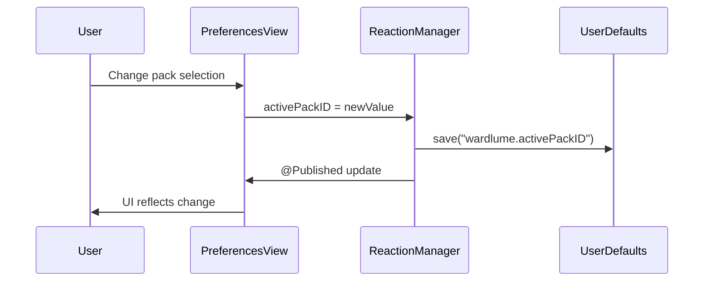
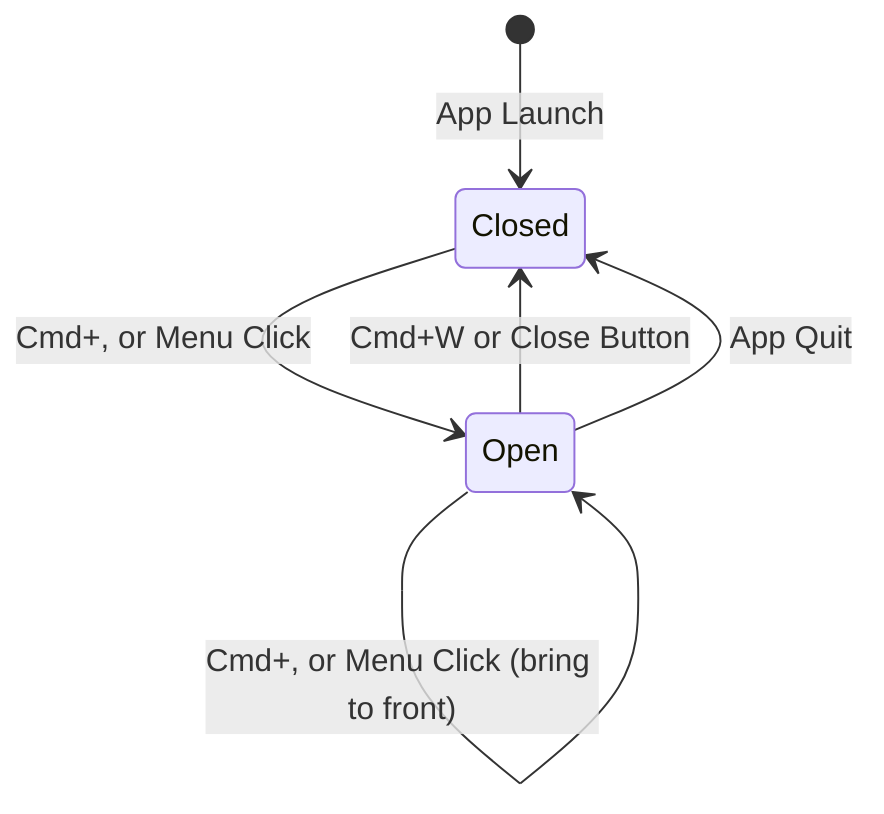

# Design Document: Settings UI for Reaction Packs

## Overview

Phase 2.5c introduces a proper SwiftUI-based preferences window to replace the temporary DEBUG menu items added in Phase 2.5b. The Settings UI provides a native macOS interface for configuring reaction pack behavior: selecting the active pack, toggling audio, adjusting cooldown duration, and previewing reactions.

**Key Design Principles:**

1. **Live Application**: All settings changes apply immediately without requiring application restart
2. **Persistent Configuration**: Settings persist to UserDefaults and restore on launch
3. **Non-Modal Experience**: Settings window remains accessible while ward is active or inactive
4. **Preview Without Penalty**: Test reactions bypass cooldown and ward-active checks
5. **Non-Regression**: Existing ward, input lock, and reaction functionality remains unchanged

**Architecture Decision: Manual NSWindow Management**

We use a manually-managed NSWindow with SwiftUI content instead of SwiftUI's Settings scene because:
- Settings scene creates a singleton window that cannot be programmatically shown/hidden on demand
- We need explicit control over window lifecycle for the "bring to front if already open" behavior (Requirement 1.5)
- AppDelegate already manages NSWindow instances for the ward overlay and reaction windows
- Manual management provides consistent window handling patterns across the codebase

## Architecture

### Component Diagram

```mermaid
graph TB
    MenuBar[Menu Bar Item: Preferences...]
    AppDelegate[AppDelegate]
    PrefsWindow[NSWindow + PreferencesView]
    ReactionManager[ReactionManager ObservableObject]
    UserDefaults[UserDefaults]
    
    MenuBar -->|openPreferences| AppDelegate
    AppDelegate -->|creates/shows| PrefsWindow
    PrefsWindow -->|@ObservedObject| ReactionManager
    PrefsWindow -->|reads/writes| UserDefaults
    ReactionManager -->|didSet observers| UserDefaults
    PrefsWindow -->|triggerForPreview| ReactionManager
```

### State Management Flow



### Window Lifecycle



## Components and Interfaces

### 1. PreferencesView (New File)

**File:** `Wardlume/PreferencesView.swift`

**Purpose:** SwiftUI view containing all settings controls

**Interface:**

```swift
struct PreferencesView: View {
    @ObservedObject var reactionManager: ReactionManager
    
    var body: some View {
        // Form with:
        // - Pack Picker
        // - Audio Toggle
        // - Cooldown Segmented Control
        // - Test Reaction Button
    }
}
```

**Key Properties:**
- `@ObservedObject var reactionManager`: Binds to ReactionManager's @Published properties

**Responsibilities:**
- Render all settings controls with proper labels and styling
- Bind controls directly to ReactionManager @Published properties using `$reactionManager.activePackID`, `$reactionManager.audioEnabled`, `$reactionManager.cooldown`
- Provide "Test Reaction" button that calls `reactionManager.triggerForPreview()`

**Note:** SwiftUI's @ObservedObject + @Published provides automatic two-way binding. No local @State variables or .onChange handlers needed — changes to controls automatically update ReactionManager properties, which trigger didSet observers for persistence.

### 2. AppDelegate Modifications

**File:** `Wardlume/AppDelegate.swift`

**New Property:**

```swift
var preferencesWindow: NSWindow?
```

**Window Visibility Note:**

When the ward is active, the preferences window will be visually obscured by the ward overlay (preferences window is at normal level ~0, ward overlay is at .screenSaver = 1000). This is acceptable behavior — users must deactivate the ward to interact with settings. The "Preferences..." menu item remains enabled while the ward is active to allow opening the window, but users will need to deactivate the ward (Cmd+Shift+W or Touch ID unlock) to see and interact with it.

**New Method:**

```swift
@objc func openPreferences() {
    if let window = preferencesWindow {
        // Window exists: bring to front
        window.makeKeyAndOrderFront(nil)
        NSApp.activate(ignoringOtherApps: true)
    } else {
        // Create new window
        let contentView = PreferencesView(reactionManager: reactionManager!)
        let hostingController = NSHostingController(rootView: contentView)
        
        let window = NSWindow(
            contentRect: NSRect(x: 0, y: 0, width: 460, height: 400),
            styleMask: [.titled, .closable, .miniaturizable],
            backing: .buffered,
            defer: false
        )
        window.title = "Wardlume Preferences"
        window.contentViewController = hostingController
        window.center()
        window.isReleasedWhenClosed = false
        window.delegate = self
        
        preferencesWindow = window
        window.makeKeyAndOrderFront(nil)
    }
}
```

**Menu Bar Changes:**

1. **Add** "Preferences..." menu item:
   - Position: After "Activate Ward", before separator
   - Key equivalent: "," (Cmd+,)
   - Action: `#selector(openPreferences)`
   - Always enabled

2. **Remove** DEBUG menu items (wrapped in `#if DEBUG`):
   - "Set Pack: Grumpy Old Man"
   - "Set Pack: Wizard"
   - "Set Pack: Silent Professional"
   - "Toggle Reaction Audio"

3. **Keep** "Test Lock (10s)" DEBUG item

**NSWindowDelegate Implementation:**

```swift
extension AppDelegate: NSWindowDelegate {
    func windowWillClose(_ notification: Notification) {
        if notification.object as? NSWindow === preferencesWindow {
            preferencesWindow = nil
        }
    }
}
```

### 3. ReactionManager Modifications

**File:** `Wardlume/ReactionManager.swift`

**Changes:**

1. **Make class conform to ObservableObject:**

```swift
final class ReactionManager: ObservableObject {
```

2. **Add @Published to settable properties:**

```swift
@Published var cooldown: TimeInterval = 5.0
@Published var activePackID: String = ReactionPack.silentProfessional.id
@Published var audioEnabled: Bool = false
```

3. **Add didSet observers for persistence:**

```swift
@Published var activePackID: String = ReactionPack.silentProfessional.id {
    didSet {
        UserDefaults.standard.set(activePackID, forKey: "wardlume.activePackID")
    }
}

@Published var audioEnabled: Bool = false {
    didSet {
        UserDefaults.standard.set(audioEnabled, forKey: "wardlume.audioEnabled")
        // Requirement 4.8: Stop audio immediately when toggle is disabled
        if !audioEnabled {
            audioPlayer?.stop()
            audioPlayer = nil
        }
    }
}

@Published var cooldown: TimeInterval = 5.0 {
    didSet {
        UserDefaults.standard.set(cooldown, forKey: "wardlume.cooldown")
    }
}
```

4. **Add initializer to restore from UserDefaults:**

```swift
// Valid cooldown values for segmented control (Requirement 5.8)
private static let validCooldowns: [Double] = [1.0, 3.0, 5.0, 10.0]

// Returns the closest valid cooldown value to the given value
private static func closestValidCooldown(_ value: Double) -> Double {
    return validCooldowns.min(by: { abs($0 - value) < abs($1 - value) }) ?? 5.0
}

init() {
    // Restore activePackID
    if let savedPackID = UserDefaults.standard.string(forKey: "wardlume.activePackID") {
        if ReactionPack.all.contains(where: { $0.id == savedPackID }) {
            self.activePackID = savedPackID
        } else {
            print("Wardlume [ReactionManager]: Invalid saved pack ID '\(savedPackID)', defaulting to silentProfessional")
            self.activePackID = ReactionPack.silentProfessional.id
        }
    }
    
    // Restore audioEnabled (default false if not set)
    self.audioEnabled = UserDefaults.standard.bool(forKey: "wardlume.audioEnabled")
    
    // Restore cooldown with closest-valid-value logic (Requirement 5.8)
    let savedCooldown = UserDefaults.standard.double(forKey: "wardlume.cooldown")
    if savedCooldown > 0 {
        self.cooldown = Self.closestValidCooldown(savedCooldown)
    } else {
        self.cooldown = 5.0
    }
}
```

5. **Add triggerForPreview() method:**

```swift
/// Trigger a reaction for preview purposes in the settings UI.
///
/// Unlike trigger(), this method:
/// - Does NOT check cooldown (allows rapid consecutive previews)
/// - Does NOT update lastFiredAt (preview doesn't consume cooldown budget)
/// - Works even when ward is inactive
///
/// Must be called on the main thread.
func triggerForPreview() {
    let pack = ReactionPack.all.first(where: { $0.id == activePackID })
               ?? .silentProfessional
    
    print("Wardlume [ReactionManager]: preview triggered for pack='\(pack.id)'")
    showReaction(pack: pack)
}
```

**Note:** The existing `showReaction(pack:)` method already handles dismissing previous overlays, so `triggerForPreview()` can safely call it multiple times in rapid succession.

## Data Models

### Settings Keys

All settings persist to `UserDefaults.standard` with the following keys:

| Key | Type | Default | Valid Values |
|-----|------|---------|--------------|
| `wardlume.activePackID` | String | `"silentProfessional"` | Any `ReactionPack.id` from `ReactionPack.all` |
| `wardlume.audioEnabled` | Bool | `false` | `true` or `false` |
| `wardlume.cooldown` | Double | `5.0` | `1.0`, `3.0`, `5.0`, `10.0` |

### Validation Rules

**activePackID:**
- On restore: If saved ID not in `ReactionPack.all`, reset to `"silentProfessional"` and log warning
- On set: No validation needed (Picker only allows valid selections)

**audioEnabled:**
- On restore: Use `UserDefaults.bool(forKey:)` which returns `false` if key doesn't exist
- On set: No validation needed (Toggle only allows true/false)

**cooldown:**
- On restore: If saved value ≤ 0, reset to `5.0`
- On set: Segmented control only allows `1.0`, `3.0`, `5.0`, `10.0`
- On display: If current value not in valid set, select closest valid option

### State Synchronization

**PreferencesView → ReactionManager:**
- User changes control → SwiftUI binding (`$reactionManager.property`) automatically updates ReactionManager property
- ReactionManager's `didSet` observer automatically persists to UserDefaults
- No intermediate @State variables or .onChange handlers needed

**ReactionManager → PreferencesView:**
- ReactionManager property changes → `@Published` triggers SwiftUI update → UI reflects new value
- This handles both user-initiated changes and programmatic changes

## Error Handling

### Corrupted Settings Recovery

**Scenario:** UserDefaults contains invalid data (wrong type, out-of-bounds value, unknown pack ID)

**Strategy:**
1. Detect corruption during `ReactionManager.init()` or property restoration
2. Log warning with specific corruption details
3. Reset corrupted setting to default value
4. Continue normal operation

**Implementation:**

```swift
// Example: activePackID validation
if let savedPackID = UserDefaults.standard.string(forKey: "wardlume.activePackID") {
    if ReactionPack.all.contains(where: { $0.id == savedPackID }) {
        self.activePackID = savedPackID
    } else {
        print("Wardlume [ReactionManager]: Invalid saved pack ID '\(savedPackID)', defaulting to silentProfessional")
        self.activePackID = ReactionPack.silentProfessional.id
        UserDefaults.standard.set(ReactionPack.silentProfessional.id, forKey: "wardlume.activePackID")
    }
}
```

### Preview Errors

**Scenario:** `triggerForPreview()` fails to load pack assets

**Strategy:**
1. `showReaction(pack:)` already handles missing assets by falling back to placeholder rendering
2. No additional error handling needed in `triggerForPreview()`
3. Existing log statements in `ReactionOverlayView.make()` provide debugging info

### Window Management Errors

**Scenario:** User closes preferences window while preview reaction is visible

**Strategy:**
1. Preview reaction window is independent of preferences window
2. Preview auto-dismisses after pack duration (existing behavior)
3. No special cleanup needed

## Testing Strategy

**Property-Based Testing Applicability:** NOT APPLICABLE

This feature is primarily concerned with:
- **UI rendering** (SwiftUI Settings window) → Use snapshot tests
- **State management** (SwiftUI bindings, ObservableObject) → Use example-based unit tests
- **Side-effect operations** (UserDefaults persistence, window lifecycle) → Use mock-based unit tests
- **Configuration validation** (pack ID existence, cooldown bounds) → Use example-based tests with specific valid/invalid inputs

Property-based testing is not appropriate for UI rendering, configuration validation, or side-effect-only operations. We will use a combination of example-based unit tests, integration tests, and manual testing instead.

### Unit Tests

**ReactionManager Persistence (Example-Based):**
1. Test `init()` restores saved settings from UserDefaults
   - Given: UserDefaults contains `activePackID="wizard"`, `audioEnabled=true`, `cooldown=3.0`
   - When: ReactionManager is initialized
   - Then: Properties match saved values
2. Test `init()` uses defaults when no saved settings exist
   - Given: UserDefaults is empty
   - When: ReactionManager is initialized
   - Then: `activePackID="silentProfessional"`, `audioEnabled=false`, `cooldown=5.0`
3. Test `init()` resets corrupted activePackID to silentProfessional
   - Given: UserDefaults contains `activePackID="unknownPack"`
   - When: ReactionManager is initialized
   - Then: `activePackID="silentProfessional"` and warning logged
4. Test `init()` resets invalid cooldown to 5.0
   - Given: UserDefaults contains `cooldown=-1.0`
   - When: ReactionManager is initialized
   - Then: `cooldown=5.0`
5. Test `didSet` observers persist changes to UserDefaults
   - Given: ReactionManager instance
   - When: `activePackID` is changed to "wizard"
   - Then: UserDefaults contains `wardlume.activePackID="wizard"`
6. Test `triggerForPreview()` bypasses cooldown check
   - Given: ReactionManager with `lastFiredAt` set to 1 second ago and `cooldown=5.0`
   - When: `triggerForPreview()` is called
   - Then: Reaction overlay appears (cooldown not enforced)
7. Test `triggerForPreview()` does not update `lastFiredAt`
   - Given: ReactionManager with `lastFiredAt` set to 10 seconds ago
   - When: `triggerForPreview()` is called
   - Then: `lastFiredAt` remains unchanged
8. Test `triggerForPreview()` dismisses previous preview before showing new one
   - Given: Preview reaction is currently visible
   - When: `triggerForPreview()` is called again
   - Then: Previous reaction window is closed before new one appears

**Settings Validation (Example-Based):**
1. Test activePackID validation rejects unknown pack IDs
   - Given: UserDefaults contains `activePackID="nonexistentPack"`
   - When: ReactionManager is initialized
   - Then: `activePackID` resets to "silentProfessional"
2. Test cooldown validation accepts valid values
   - Given: UserDefaults contains `cooldown=1.0`, `cooldown=3.0`, `cooldown=5.0`, `cooldown=10.0`
   - When: ReactionManager is initialized
   - Then: `cooldown` matches saved value
3. Test cooldown validation rejects invalid values
   - Given: UserDefaults contains `cooldown=0.0` or `cooldown=-5.0`
   - When: ReactionManager is initialized
   - Then: `cooldown` resets to 5.0
4. Test audioEnabled accepts only boolean values
   - Given: UserDefaults contains `audioEnabled=true` or `audioEnabled=false`
   - When: ReactionManager is initialized
   - Then: `audioEnabled` matches saved value

### Integration Tests

**Settings Window Lifecycle:**
1. Test Cmd+, opens preferences window
   - Given: App is running, no preferences window open
   - When: User presses Cmd+,
   - Then: Preferences window appears
2. Test Cmd+, brings existing window to front (no duplicate)
   - Given: Preferences window is already open but not focused
   - When: User presses Cmd+,
   - Then: Existing window comes to front, no duplicate created
3. Test Cmd+W closes preferences window
   - Given: Preferences window is focused
   - When: User presses Cmd+W
   - Then: Preferences window closes
4. Test close button closes preferences window
   - Given: Preferences window is open
   - When: User clicks close button
   - Then: Preferences window closes and `preferencesWindow` is set to nil
5. Test window reopens after being closed
   - Given: Preferences window was closed
   - When: User presses Cmd+, again
   - Then: New preferences window appears

**Live Settings Application:**
1. Test changing pack selection updates ReactionManager.activePackID
   - Given: Preferences window is open with "Silent Professional" selected
   - When: User selects "Wizard" from picker
   - Then: `reactionManager.activePackID` becomes "wizard" within 100ms
2. Test changing audio toggle updates ReactionManager.audioEnabled
   - Given: Preferences window is open with audio toggle OFF
   - When: User toggles audio ON
   - Then: `reactionManager.audioEnabled` becomes true within 100ms
3. Test changing cooldown updates ReactionManager.cooldown
   - Given: Preferences window is open with 5 seconds selected
   - When: User selects 3 seconds
   - Then: `reactionManager.cooldown` becomes 3.0 within 100ms
4. Test next trigger() after settings change uses new configuration
   - Given: User changes pack to "Wizard" in settings
   - When: Next intrusion trigger() fires
   - Then: Wizard pack reaction appears
5. Test preview uses current settings immediately
   - Given: User changes pack to "Grumpy Old Man" in settings
   - When: User clicks "Test Reaction" button
   - Then: Grumpy Old Man pack reaction appears

**Menu Bar Integration:**
1. Test "Preferences..." menu item opens window
   - Given: App is running
   - When: User clicks "Preferences..." menu item
   - Then: Preferences window appears
2. Test "Preferences..." menu item enabled when ward inactive
   - Given: Ward is not active
   - When: User opens menu bar dropdown
   - Then: "Preferences..." menu item is enabled
3. Test "Preferences..." menu item enabled when ward active
   - Given: Ward is active
   - When: User opens menu bar dropdown
   - Then: "Preferences..." menu item is enabled
4. Test DEBUG pack selector items removed
   - Given: App is running in release mode
   - When: User opens menu bar dropdown
   - Then: "Set Pack: Grumpy Old Man", "Set Pack: Wizard", "Set Pack: Silent Professional", "Toggle Reaction Audio" items are not present
5. Test "Test Lock (10s)" DEBUG item still present
   - Given: App is running in debug mode
   - When: User opens menu bar dropdown
   - Then: "Test Lock (10s)" menu item is present

### Manual Testing Scenarios

**Preview Functionality:**
1. Open preferences, click "Test Reaction" → reaction appears
2. Click "Test Reaction" rapidly 5 times → 5 reactions appear with no delay
3. Trigger real intrusion after preview → cooldown still applies normally
4. Change pack, click "Test Reaction" → new pack appears
5. Enable audio, click "Test Reaction" → audio plays (if pack has audio)

**Settings Persistence:**
1. Change all settings, quit app, relaunch → settings restored
2. Corrupt UserDefaults manually, relaunch → defaults restored, warning logged
3. Delete UserDefaults keys, relaunch → defaults used

**Non-Regression:**
1. Activate ward → Metal overlay appears, input locked
2. Trigger intrusion → reaction appears (respects cooldown)
3. Deactivate ward → reaction dismissed, input unlocked
4. Cmd+Shift+W while ward active → ward deactivates
5. Cmd+Shift+U while ward active → Touch ID prompt, deactivates on success

## Implementation Plan

### File Changes Summary

**New Files (1):**
- `Wardlume/PreferencesView.swift` — SwiftUI settings view

**Modified Files (2):**
- `Wardlume/AppDelegate.swift` — Add preferences window management, menu item, remove DEBUG items
- `Wardlume/ReactionManager.swift` — Add ObservableObject conformance, @Published properties, didSet observers, init(), triggerForPreview()

**Total: 3 files** (within constraint)

### Implementation Order

1. **ReactionManager modifications** (foundation layer)
   - Add ObservableObject conformance
   - Add @Published to properties
   - Add didSet observers for persistence
   - Add init() with UserDefaults restoration
   - Add triggerForPreview() method

2. **PreferencesView creation** (UI layer)
   - Create SwiftUI view with all controls
   - Implement two-way binding to ReactionManager
   - Add UserDefaults persistence on changes
   - Add "Test Reaction" button

3. **AppDelegate integration** (glue layer)
   - Add preferencesWindow property
   - Add openPreferences() method
   - Add "Preferences..." menu item
   - Remove DEBUG pack selector items
   - Implement NSWindowDelegate for cleanup

### Testing Checkpoints

After each implementation step:
1. Build succeeds without errors
2. Run app, verify no crashes
3. Test specific functionality added in that step

Final verification:
1. Run full test suite
2. Manual testing of all requirements
3. Verify non-regression scenarios

## Non-Regression Verification

### Existing Functionality Checklist

**Ward Activation/Deactivation:**
- [ ] Cmd+Shift+W toggles ward
- [ ] Menu "Activate Ward" / "Deactivate Ward" works
- [ ] Metal overlay appears at screenSaver level
- [ ] CGEventTap installs/uninstalls correctly

**Input Locking:**
- [ ] Keyboard blocked while ward active
- [ ] Mouse blocked while ward active
- [ ] Menu bar remains accessible
- [ ] Wardlume windows remain accessible

**Reaction System:**
- [ ] Intrusion triggers reaction (respects cooldown)
- [ ] Reaction overlay appears at screenSaver+1
- [ ] Reaction auto-dismisses after pack duration
- [ ] Reaction dismissed on ward deactivation
- [ ] Audio plays when enabled (if pack has audio)

**Biometric Unlock:**
- [ ] Cmd+Shift+U triggers Touch ID prompt
- [ ] Successful auth deactivates ward
- [ ] Failed auth keeps ward active

**Menu Bar:**
- [ ] Status bar icon visible
- [ ] All menu items functional
- [ ] Menu accessible while ward active (window level lowering)

### Breaking Change Risks

**Low Risk:**
- Adding @Published to ReactionManager properties (backward compatible)
- Adding new triggerForPreview() method (additive)
- Adding new menu item (additive)

**Medium Risk:**
- Removing DEBUG menu items (intentional, documented change)
- Adding init() to ReactionManager (must not break existing instantiation in AppDelegate)

**Mitigation:**
- Test ReactionManager instantiation in AppDelegate after adding init()
- Verify DEBUG menu items removed only in release builds
- Test all existing trigger() call sites still work

## Future Enhancements

**v1.6 Custom Packs:**
- File picker to select custom image/audio
- Pack metadata editor (name, duration, colors)
- Pack import/export

**v1.7 Advanced Settings:**
- Reaction animation style (fade, slide, zoom)
- Reaction position (center, top, bottom)
- Multiple pack rotation (cycle through packs on each trigger)

**v1.8 Analytics:**
- Intrusion attempt counter display in settings
- Intrusion history log
- Most-triggered time of day chart
