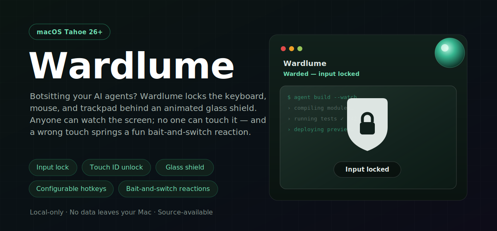

<p align="center">
  
</p>

<p align="center">
  <a href="https://github.com/arpitagarwal1301/wardlume/actions"></a>
  
  <a href="LICENSE"></a>
</p>

> Cast a watching ward over your Mac. See your AI agents work. Intruders can't.

**Wardlume** is a macOS menu-bar app for **botsitting** — leaving your AI coding agents (Claude Code, Cursor, …) running while you step away. It locks the keyboard, mouse, and trackpad behind an animated glass shield, so the screen stays fully visible — anyone in the room can watch the agent work — but nothing can be touched. Unlock instantly with Touch ID.

## Features

- 🛡️ **Glass-shield ward** — an animated Metal overlay over your live desktop. The screen stays readable while input is hard-locked at the macOS event-tap level.
- 👆 **Touch ID unlock** — rest your finger or press your unlock shortcut; falls back to your password.
- ⌨️ **Configurable hotkeys** — remap the activate and unlock shortcuts, with an optional no-auth emergency-exit key.
- 🎭 **Bait-and-switch reactions** — a wrong touch springs a reaction image and sound. Ships with **Silent Professional**, **Wizard**, and **Grumpy Old Man** packs, or drop in your own cover image, reaction image, and audio.
- 🖥️ **Multi-display aware** — secondary screens are covered while the ward is active.
- 🔒 **Local-only** — no network, no analytics, no accounts. Nothing leaves your Mac.

> Wardlume isn't notarized by Apple yet. **Homebrew is the cleanest install** — it sidesteps the Gatekeeper "damaged" prompt entirely. The direct downloads work too, with one small one-time step.

### Homebrew (recommended)

```sh
brew tap arpitagarwal1301/tap
brew trust arpitagarwal1301/tap   # one-time, required for third-party taps on Homebrew 6+
brew install --cask wardlume
```

Installs cleanly with no "damaged" prompt and no quarantine cleanup.

### Installer (`.pkg`)

1. Download **`Wardlume-1.2.0.pkg`** from the [latest release](https://github.com/arpitagarwal1301/wardlume/releases/latest).
2. Open it; if macOS calls it "unidentified," **right-click → Open** (or System Settings → Privacy & Security → **Open Anyway**) once.
3. Click through the installer — Wardlume lands in Applications and opens normally.

### Disk image (`.dmg`)

1. Download `Wardlume-1.2.0.dmg` and drag **Wardlume** into Applications.
2. macOS will say **"Wardlume is damaged"** — it isn't; unsigned downloads are just quarantined. Clear it once:
   ```bash
   xattr -dr com.apple.quarantine /Applications/Wardlume.app
   ```

> Requires **macOS Tahoe 26+** on Apple Silicon. Source-available — read every line of what it does in this repo.

## Usage

1. Launch Wardlume — it lives in your menu bar.
2. Press **⌘⇧L** from anywhere (even while focused in your IDE), or use the menu, to **activate the ward**.
3. Walk away. The screen stays visible under the glass shield; keyboard, mouse, and trackpad are locked.
4. Return and **rest your finger on Touch ID** — or press **⌘⇧U** — to unlock.

Want a guaranteed way out? Enable the optional **emergency-exit** shortcut in **Settings → Shortcuts** (off by default).

## Permissions

On first activation Wardlume requests three permissions, each used only while the ward is active:

| Permission | Why |
|---|---|
| **Screen Recording** | Render the live desktop behind the glass (never saved or transmitted) |
| **Accessibility** | Lock the keyboard, mouse, and trackpad |
| **Input Monitoring** | Detect intrusion attempts |

> [!IMPORTANT]
> After granting these in **System Settings → Privacy & Security**, **quit and relaunch** Wardlume for them to take effect.

## Build from source

Requires **Xcode 16+** on macOS Tahoe 26+.

```bash
git clone https://github.com/arpitagarwal1301/wardlume.git
cd wardlume
open Wardlume.xcodeproj
```

Select the **Wardlume** scheme and press **⌘R**. Built with Swift, SwiftUI, AppKit, Metal, and ScreenCaptureKit.

## More

- [Safety notes](SAFETY_NOTES.md) — escape hatches and security boundaries
- [Privacy](PRIVACY.md) · [Terms](TERMS.md)
- [Roadmap](ROADMAP.md) · [Contributing](CONTRIBUTING.md)
- [License](LICENSE) — PolyForm Noncommercial 1.0.0 (noncommercial use; commercial use reserved)

---

Built with 🪄 by Arpit Agarwal. Inspired by every Mac running AI agents at coffee shops worldwide.
