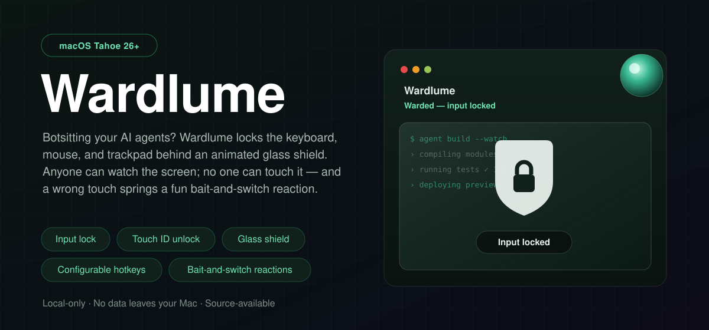

<p align="center">
  
</p>

<p align="center">
  <a href="https://github.com/arpitagarwal1301/wardlume/releases/latest"></a>
  
  <a href="LICENSE"></a>
</p>

> Cast a watching ward over your Mac. See your AI agents work. Intruders can't.

**Wardlume** is a macOS menu-bar app for **botsitting** — leaving your AI coding agents (Claude Code, Cursor, …) running while you step away. It locks the keyboard, mouse, and trackpad behind an animated glass shield, so the screen stays fully visible — anyone in the room can watch the agent work — but nothing can be touched. Unlock instantly with Touch ID.

## Features

- 🛡️ **Glass-shield ward** — an animated Metal overlay over your live desktop. The screen stays readable while input is hard-locked at the macOS event-tap level.
- 🧭 **Guided setup** — a first-launch wizard walks you through all three permissions (request → grant → verified live), powered by [PermissionPilot](https://github.com/arpitagarwal1301/PermissionPilot), our open-source permissions-onboarding SDK for Mac apps.
- 👆 **Touch ID unlock** — rest your finger or press your unlock shortcut; falls back to your password.
- ⌚ **Apple Watch unlock** — tap the Mac, then double-press your watch's side button. Built-in setup steps and a "Send test to watch" check are in **Settings → Lock & unlock**.
- ⌨️ **Configurable hotkeys** — remap the activate and unlock shortcuts, with an optional no-auth emergency-exit key.
- 🎭 **Bait-and-switch reactions** — a wrong touch springs a reaction image and sound. Ships with **Silent Professional**, **Wizard**, and **Grumpy Old Man** packs, or drop in your own cover image, reaction image, and audio.
- ☕ **Keeps your Mac awake** — while the ward is up, the display and system won't idle-sleep, so the ward holds and your agents keep running. On by default; toggle it in **Settings → Automation**.
- ⏱️ **Auto-ward when idle** — optionally casts the ward after 1–15 minutes without keyboard or mouse input, with a 10-second countdown you cancel by moving the mouse. Off by default.
- 🚀 **Launch at login** — starts quietly in the menu bar when you log in, so it's always ready. On by default; toggle it in **Settings → Automation**.
- 🖥️ **Multi-display aware** — the ward appears on the display you activate it from. Other monitors stay visible but locked (or blacked out, your choice), and plugging or unplugging a monitor never unlocks it.
- 🔒 **Local-only** — no network, no analytics, no accounts. Nothing leaves your Mac.

> Wardlume isn't notarized by Apple yet. **Homebrew is the cleanest install** — it sidesteps the Gatekeeper "damaged" prompt entirely. The direct downloads work too, with one small one-time step.

### Homebrew (recommended)

```sh
brew tap arpitagarwal1301/tap
brew trust arpitagarwal1301/tap
brew install --cask wardlume
```

Installs cleanly — no "damaged" prompt, no quarantine cleanup. Homebrew 6+ requires trusting a third-party tap once before installing from it; on older Homebrew, `brew trust` doesn't exist and isn't needed — just skip that line.

### Installer (`.pkg`)

1. Download **`Wardlume-1.7.2.pkg`** from the [latest release](https://github.com/arpitagarwal1301/wardlume/releases/latest).
2. Open it; if macOS calls it "unidentified," **right-click → Open** (or System Settings → Privacy & Security → **Open Anyway**) once.
3. Click through the installer — Wardlume lands in Applications and opens normally.

### Disk image (`.dmg`)

1. Download `Wardlume-1.7.2.dmg` and drag **Wardlume** into Applications.
2. macOS will say **"Wardlume is damaged"** — it isn't; unsigned downloads are just quarantined. Clear it once:
   ```bash
   xattr -dr com.apple.quarantine /Applications/Wardlume.app
   ```

> Requires **macOS Tahoe 26+** on Apple Silicon.

## Usage

1. Launch Wardlume — it lives in your menu bar.
2. Press **⌘⇧L** from anywhere (even while focused in your IDE), or use the menu, to **activate the ward**.
3. Walk away. The screen stays visible under the glass shield; keyboard, mouse, and trackpad are locked — and your Mac stays awake, so the ward holds and your agents keep running.
4. Return and **rest your finger on Touch ID** — or press **⌘⇧U** — to unlock.

Want a guaranteed way out? Enable the optional **emergency-exit** shortcut in **Settings → Advanced** (off by default).

## Permissions

On first launch a **guided setup** (built on [PermissionPilot](https://github.com/arpitagarwal1301/PermissionPilot)) walks you through the three permissions Wardlume needs, each used only while the ward is active:

| Permission | Why |
|---|---|
| **Screen Recording** | Render the live desktop behind the glass (never saved or transmitted) |
| **Accessibility** | Lock the keyboard, mouse, and trackpad |
| **Input Monitoring** | Detect intrusion attempts |

Once Screen Recording is granted, macOS may also ask one time whether Wardlume can **"bypass the system private window picker"** to capture the screen directly. Wardlume triggers this at launch, before any ward is up, so you can click **Allow** right away.

Keeping your Mac awake needs **no permission** — it uses a standard power assertion (the same mechanism as `caffeinate`), held only while the ward is active.

The wizard requests each one, deep-links to the exact System Settings pane, re-checks live as you grant, and offers a one-click **Quit & Reopen** for the grants macOS only applies after a relaunch. If a permission goes missing later, the menu bar shows **Finish permissions setup…** to reopen it — and when everything is granted, opening Wardlume lands on **Settings → Overview** instead.

## FAQ

<details>
<summary><b>Is my screen hidden while warded?</b></summary>

No, and that's the point. The screen stays visible so anyone nearby can watch your agent work. Only **input** is locked. If you'd rather other monitors go dark, choose **Settings → Displays & gestures → Other monitors → Black out**.
</details>

<details>
<summary><b>What if I get stuck?</b></summary>

You always have a way out: **Touch ID / your unlock shortcut**, your **Apple Watch**, or **⌘⌥Esc → Force Quit Wardlume** (macOS reserves that shortcut, so no app can block it). You can also enable an emergency-exit key. See the [Safety guide](SAFETY.md).
</details>

<details>
<summary><b>Does it work with Claude Code, Codex, Cursor, …?</b></summary>

Yes. Wardlume doesn't care what's running. It locks input for the whole Mac while every app keeps working on screen, so any agent, build, render, or download carries on.
</details>

<details>
<summary><b>Apple Watch unlock isn't working</b></summary>

Open **Settings → Lock & unlock → Unlock with Apple Watch** and follow the setup steps. In short: your watch has to be signed in to the same Apple Account, have a passcode, be on your wrist and unlocked, and be enabled in **System Settings → Touch ID & Password**. Then press **Send test to watch**.
</details>

<details>
<summary><b>How do I uninstall?</b></summary>

First turn off **Settings → Automation → Launch at login** (or remove Wardlume in System Settings → General → Login Items). Then run `brew uninstall --cask wardlume`, or quit Wardlume and drag it from Applications to the Trash.
</details>

<details>
<summary><b>Is it free?</b></summary>

Yes, for any **noncommercial** use (personal, study, hobby, nonprofit). Commercial use needs a license. See [Terms](TERMS.md).
</details>

## Support

- 🐛 **Found a bug or have an idea?** [Open an issue](https://github.com/arpitagarwal1301/wardlume/issues/new/choose).
- 💬 **Questions:** [Discussions](https://github.com/arpitagarwal1301/wardlume/discussions).
- 💚 **Enjoying Wardlume?** [Sponsor its development](https://github.com/sponsors/arpitagarwal1301).

## More

- [Safety guide](SAFETY.md) — every way out, and what the ward blocks
- [Changelog](CHANGELOG.md) — what's new in each version
- [PermissionPilot](https://github.com/arpitagarwal1301/PermissionPilot) — the zero-dependency SwiftUI permissions/onboarding SDK behind Wardlume's setup wizard (also ours, MIT)
- [Privacy](PRIVACY.md) · [Terms](TERMS.md)
- [License](LICENSE) — PolyForm Noncommercial 1.0.0 (noncommercial use; commercial use reserved)

---

Built with 🪄 by Arpit Agarwal. Inspired by every Mac running AI agents at coffee shops worldwide.
